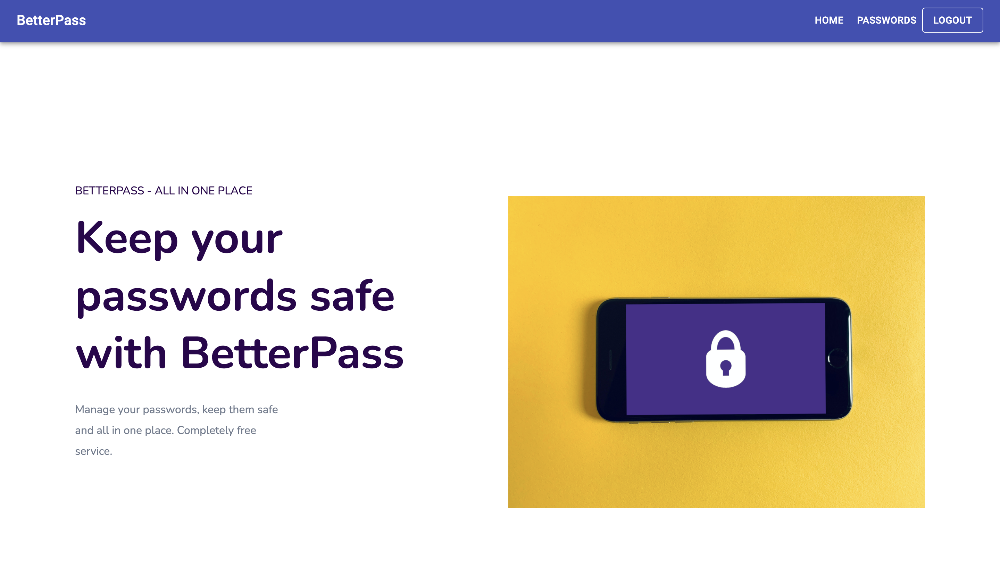
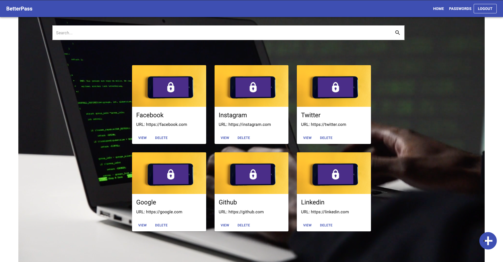
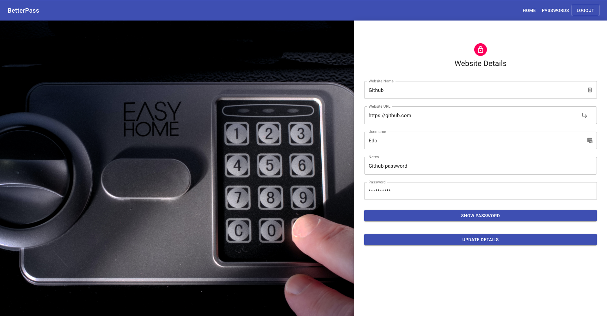

# BetterPass Website

## A WebApp to safely store all your passwords and retrieve them by just remembering the main one. 
 

## Check it out at [https://betterpass.nw.r.appspot.com/](https://betterpass.nw.r.appspot.com/)

Login credentials to play around with it without creating a new user:
* username: admin
* password: admin

 

### Main Features
* Backend: Django Rest Framework

* Frontend: React

* JWT Authentication: implemented state of the art authentication system using JWT token ([More info here](https://www.google.com))

* Symmetric entryption for personal passwords implemente using the Fernet algorithm

* Deployed using Google Cloud App Engine

 

### Pages
#### Home Page

 

#### Password List Page

 

#### Website Detail Page

